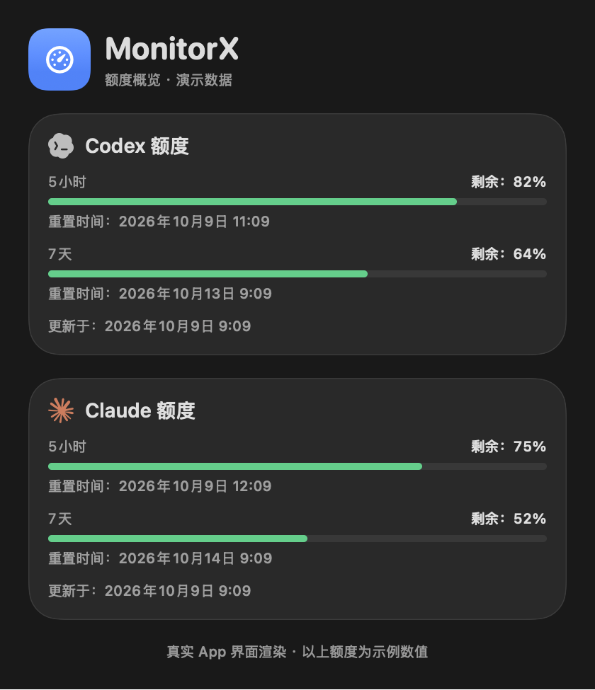
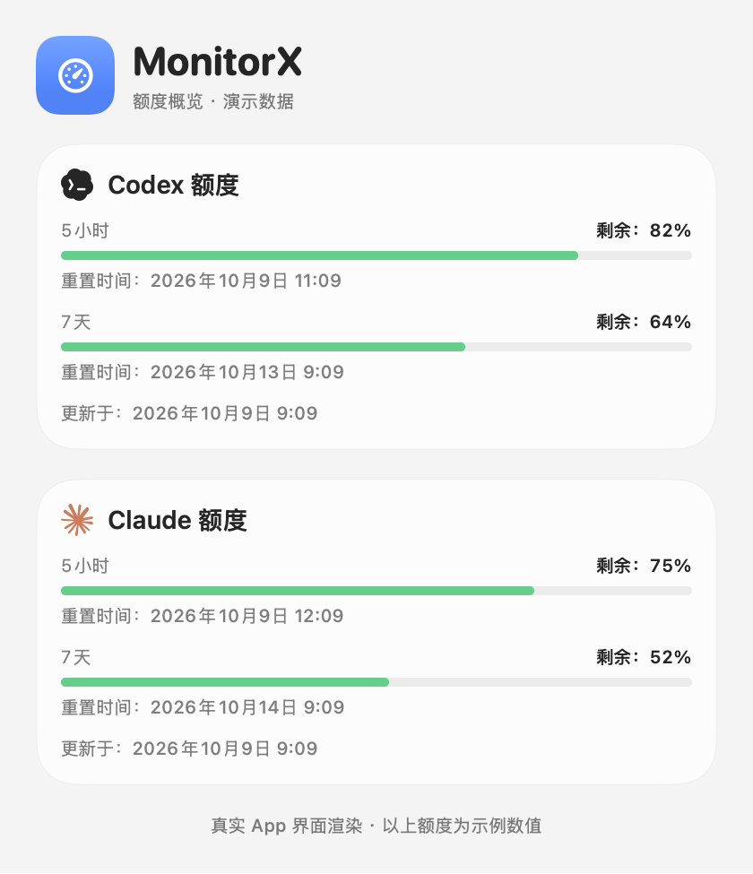

<div align="center">


# MonitorX

[简体中文](README.md) · **English**

**See what's using your Mac, at a glance.**

A macOS 26 menu bar system monitor · Liquid Glass · System usage + Codex / Claude quotas

</div>

---

## Highlights

- **See which app is responsible**: overview cards identify the app using the most of each resource. Detail pages group processes by app, so Chrome's many Helper processes appear as one row. Expand a row to inspect individual processes.
- **Dedicated pages**: overview, CPU, memory, network, disk, sensors and hardware.
- **Menu bar monitoring**: choose CPU, memory, network speed and disk activity. Compact two-line indicators support light and dark backgrounds.
- **AI quotas** (direct edition): view Codex / Claude remaining quotas and reset times in the overview and menu bar. Codex refreshes automatically; Claude offers one-click connection and guides you through official sign-in.
- **Load-based colors**: bars use their normal theme color at low load, then turn yellow, orange and red as usage rises.
- **Lightweight**: approximately 1% of one CPU core and 27 MB of memory with the panel closed. Process-level sampling runs only while a monitoring window or panel is visible.
- **Local system monitoring**: system metrics are collected on your Mac. Optional Codex quota monitoring uses the official local CLI to query OpenAI; no data is uploaded to the MonitorX developer.
- **23 languages**: English, Simplified Chinese, Traditional Chinese, Japanese, Korean, Spanish, French, German, Italian, Portuguese, Russian, Ukrainian, Polish, Dutch, Swedish, Turkish, Arabic, Hebrew, Hindi, Thai, Vietnamese, Indonesian and Malay. The app follows your system language by default; change it through `···` → Language. Arabic and Hebrew use right-to-left layouts.

<div align="center">

<br><sub>Menu bar: CPU · Memory · Network speed</sub>
</div>

## Screenshots

<table>
  <tr>
    <td align="center"><br><b>Overview</b><br><sub>Resource cards, battery, temperature and fans</sub></td>
    <td align="center"><br><b>CPU</b><br><sub>User / system / idle, load and individual cores</sub></td>
    <td align="center"><br><b>Memory</b><br><sub>Composition, pressure and swap</sub></td>
  </tr>
  <tr>
    <td align="center"><br><b>Network</b><br><sub>Upload / download speed and usage by app</sub></td>
    <td align="center"><br><b>Disk</b><br><sub>Volume capacity and read / write throughput</sub></td>
    <td align="center"><br><b>Sensors</b><br><sub>Temperature sensors and fans</sub></td>
  </tr>
  <tr>
    <td align="center"><br><b>Hardware</b><br><sub>Model, chip, GPU and battery health</sub></td>
    <td align="center"><br><b>App Store · Overview</b><br><sub>Sandboxed edition without process rankings</sub></td>
    <td align="center"><br><b>App Store · Hardware</b><br><sub>Sandbox-compatible serial number and GPU lookup</sub></td>
  </tr>
</table>

> These screenshots show the running app on an Intel MacBook Pro with macOS 26.3. Liquid Glass lets the desktop wallpaper show through the panel; these captures use a dark background. The screenshots show the Chinese UI, but English is available in the app's language settings.

<a id="ai-usage"></a>

## AI quotas: Codex / Claude

Check system usage and remaining AI quotas while coding. The overview shows quota windows, reset times and the last update time. The menu bar shows each provider's lowest remaining percentage across its known quota windows. Available in the direct edition only.

<table>
  <tr>
    <td align="center"><br><b>Quotas · Dark</b></td>
    <td align="center"><br><b>Quotas · Light</b></td>
  </tr>
</table>

> These two images use the production app UI with clearly labeled **demo quota readings**, not actual account usage. Run `Scripts/render_usage_screenshots.sh` to regenerate the README and landing-page images.

| Provider | Setup | Updates |
| --- | --- | --- |
| Codex | Install the official Codex CLI, sign in with ChatGPT, then open MonitorX | Every 5 minutes, with manual refresh available |
| Claude | Click **Connect Claude Code**, follow the card's prompts to sign in with Pro / Max, then send a message in the Claude Code session that opens | Appears after the first reply, then updates through official status-line callbacks |

Claude web and desktop chats do not update this connection. API billing sign-ins do not provide the subscription quotas shown here. MonitorX checks installation and sign-in status, preserves your original status-line configuration and restores it when disconnected. You still need to complete browser authorization yourself once.

The app displays the latest reading: `*` in the menu bar means a stale reading or failed refresh; `–` means no data yet. Codex's read-only query does not initiate a model task. MonitorX does not automatically send Claude messages to obtain usage data, or read or export login credentials.

## Installation

**Install a release** using a `.dmg` from `dist/` or the download button on the [landing page](website/README.md):

1. Open the DMG and drag MonitorX into Applications.
2. If macOS cannot verify the developer for an unnotarized build, run:
   ```bash
   xattr -cr /Applications/MonitorX.app
   ```
   Alternatively, right-click the app and choose Open.
3. The main window opens at launch. Close it or click the yellow minimize button to keep MonitorX running in the menu bar.

**Build from source** with Command Line Tools and the macOS 26 SDK; Xcode is not required:

```bash
Scripts/build.sh          # build/MonitorX.app: universal x86_64 + arm64, ad-hoc signed
open build/MonitorX.app
```

Launching normally opens the main window; `--show` is no longer necessary, but remains compatible. Open the app again from Finder or Launchpad to restore its window, even if the menu bar icon is hidden.

## Usage

- **Main window**: opens at launch. Closing or minimizing it hides it to the menu bar. A Dock entry is available while the window is visible.
- **Left-click the menu bar item**: brings the main window forward if visible; otherwise opens the quick panel. Press `Esc` or click elsewhere to dismiss the panel.
- **Right-click**: opens a menu to show the main window or quit.
- **Notched displays**: Automatic menu bar appearance prioritizes compact quota indicators on displays with a camera notch, or an icon when quotas are disabled. Other displays show live metrics. Choose Icon Only or Live Metrics in settings. macOS controls placement; using less space cannot guarantee visibility in a crowded menu bar.
- **Settings**: use `···` at the top right to choose menu bar metrics, enable launch at login, change language or quit. Show Codex Usage and Show Claude Usage independently control overview cards, separately from the menu bar quota toggles. Hidden cards are also omitted from image and text exports. Hiding the Claude card does not disconnect Claude Code.
- **Claude quotas** (direct edition): Connect Claude Code configures the official `statusLine` bridge and opens Claude Code in Terminal. If the CLI is missing, the app opens its official installation guide. If signed out, Sign in to Claude starts the official login flow and then opens an interactive session. A dedicated working folder avoids project-level status-line overrides. Existing status-line commands and settings are preserved and restored on disconnect. After a Pro / Max Claude Code reply, available 5-hour / 7-day quotas appear automatically. Readings older than 15 minutes, or whose quota window has reset, are marked stale. Other projects that override `statusLine` need that override removed to use the bridge. Only quota fields and the update timestamp are stored locally; image and text exports can include them.
- **Codex in the menu bar** (direct edition): CODEX and its remaining percentage are enabled by default and can be disabled independently. The indicator shows the lowest remaining percentage across the main Codex quota's known windows. Hover for individual windows and reset times. Automatic mode on notched displays shows only enabled Codex / Claude quota indicators. Icon Only shows quotas in the tooltip. Failed refreshes retain old values with `*`; unavailable data shows `–`.
- **Codex quotas** (direct edition): overview cards refresh every 5 minutes and support manual refresh. Requires the official Codex CLI signed in with ChatGPT. MonitorX uses the official `codex app-server` read-only `account/rateLimits/read` interface without reading credentials or initiating model tasks. It displays returned quota buckets and does not estimate missing windows. Failed refreshes preserve the previous reading and timestamp with an error. Disable the overview card in settings; polling stops when both the card and menu bar quota are disabled. This feature is unavailable in the sandboxed App Store edition.
- **Sharing**: export the current page or all pages as images or text, to the clipboard or a UTF-8 `.txt` file. Text includes the export time, current metrics and the top 8 apps / processes according to your grouping setting. It omits the device serial number. Sampling continues during the save dialog, but exported text retains the readings captured when you clicked export.
- **Detail pages**: click an overview card to open its page. Rankings group processes by app by default; expand a row for individual processes or switch grouping at the top right.
- **Serial number**: click it on the hardware page to copy it.

## Localization

- Translations live in `Resources/Localization/<language>.lproj/Localizable.strings`. `Scripts/build.sh` copies them into the app and writes `CFBundleLocalizations`, allowing a per-app language in macOS System Settings → General → Language & Region → Applications.
- `swift run` and debug builds load translations from the SwiftPM resource bundle. Language changes take effect without restarting.
- Run `Scripts/check_language_switch.sh` to verify language switching, preference persistence and UI refresh notifications for debug and packaged resources. Only Command Line Tools are needed.
- Use `L("English text")` or `L("Format %@", arg)` in code. Keys are English text; missing translations fall back to English.
- After changing UI text, run `Scripts/check_localizations.py` to check missing or extra keys and `%@` / `%1$@` placeholder consistency across languages.
- To add a language, copy and translate `en.lproj`, then add a case to `AppLanguage` in `Sources/MonitorX/App/Localization.swift`.

## Editions

| | Direct edition | App Store edition |
| --- | --- | --- |
| Build | `Scripts/build.sh` → `build/MonitorX.app` | `EDITION=appstore Scripts/build.sh` → `build/appstore/MonitorX.app` |
| Package | `Scripts/release.sh`: signing, notarization and DMG | `Scripts/release_appstore.sh`: signing, PKG and App Store Connect upload |
| Sandbox | No | Yes: `Resources/AppStore.entitlements` |
| CPU / memory / network / disk / battery / hardware | ✅ | ✅ |
| App and process rankings | ✅ | ❌ Sandbox restrictions |
| Sensors: temperatures and fans | ✅ | ❌ AppleSMC is unavailable in the sandbox |
| Codex / Claude quotas and menu bar indicators | ✅ | ❌ |
| Image and text clipboard / file exports | ✅ | ✅ |

The App Store edition uses `-DAPPSTORE` to compile out restricted features such as `ps`, `netstat`, `system_profiler` and SMC access. Serial number, GPU and display information use IOKit registry, Metal and AppKit instead. The App Store build script applies an ad-hoc sandbox signature for local testing under the same restrictions.

## Packaging and releases

```bash
# Direct edition: signing, notarization and DMG.
# Without a certificate, the script creates an ad-hoc build for local use.
VERSION=1.1.0 \
SIGN_IDENTITY="Developer ID Application: Your Name (TEAMID)" \
NOTARY_PROFILE=notary \
Scripts/release.sh

# App Store edition: signed PKG for App Store Connect.
# Without certificates, the script creates a local sandboxed test build.
BUNDLE_ID=com.yourname.monitorx TEAM_ID=ABCDE12345 VERSION=1.1.0 BUILD_NUMBER=1 \
APP_IDENTITY="Apple Distribution: Your Name (TEAMID)" \
INSTALLER_IDENTITY="3rd Party Mac Developer Installer: Your Name (TEAMID)" \
PROVISION_PROFILE=~/Downloads/MonitorX.provisionprofile \
Scripts/release_appstore.sh
```

Both scripts document one-time certificate, notarization and provisioning setup in their header comments. Output goes to `dist/`.

**GitHub Actions releases**: pushing a `v*` tag triggers [the release workflow](.github/workflows/release.yml). It builds the direct edition on a macOS 26 runner and uploads the DMG, ZIP and `SHA256SUMS.txt` to the corresponding GitHub Release. Tags containing `-`, such as `v1.2.0-beta.1`, create prereleases.

```bash
git tag v1.2.0 && git push origin v1.2.0
```

Configure these repository Actions secrets for signed and notarized CI releases. Without them, CI publishes an ad-hoc signed build.

| Secret | Value |
| --- | --- |
| `MACOS_CERT_P12` | Base64-encoded Developer ID Application `.p12` certificate, including the private key |
| `MACOS_CERT_PASSWORD` | Password used when exporting the `.p12` |
| `NOTARY_KEY` | Contents of the App Store Connect API key file, `AuthKey_XXXX.p8` |
| `NOTARY_KEY_ID` | Key ID for that API key |
| `NOTARY_ISSUER` | Issuer ID from the App Store Connect API key page |

## Landing page: Docker deployment

[`website/`](website/) is a static landing page served by nginx, with no build step:

```bash
cd website
docker compose up -d --build      # http://localhost:8080; set PORT=3000 to change the port
```

Download buttons link directly to GitHub Releases and automatically use the latest stable release. Installers do not need to be stored on your server. Set `PORT=3000` in `website/.env` to change the port. See [website/README.md](website/README.md) for details.

## Data sources

| Metric | Source |
| --- | --- |
| Total / per-core CPU | `host_processor_info` |
| Memory composition / pressure / swap | `host_statistics64`, `sysctl` |
| Network speed | `getifaddrs`, using only `en*` interfaces |
| Disk capacity / throughput | `URLResourceValues`, IOKit `IOBlockStorageDriver` |
| Process CPU / memory / disk | `proc_pid_rusage`; memory uses the footprint definition used by Activity Monitor |
| Root processes such as WindowServer | `ps`; memory is RSS |
| Process network activity | `netstat -anv`; differences in cumulative socket bytes, excluding loopback traffic |
| Temperature / fans | AppleSMC, enumerating all `T*` sensor keys in the direct edition |
| Battery | IOKit `AppleSmartBattery` |
| Serial number / GPU / displays | Direct: `system_profiler`; App Store: IOKit registry / Metal / AppKit |
| Codex quotas | Official Codex CLI app-server, `account/rateLimits/read` |
| Claude quotas | Official Claude Code `statusLine` callbacks |

Only system-level metrics are sampled while the monitoring UI is hidden. Process-level sampling runs every 3 seconds while the main window or panel is visible. Quota monitoring follows the update rules described above.

## Known limitations

- Requires macOS 26 for `NSGlassEffectView` and `glassEffect`.
- Default release builds are ad-hoc signed and not notarized. Use `Scripts/release.sh` with a Developer ID for signed distribution.
- Root-process memory uses RSS, which differs slightly from Activity Monitor's footprint metric.
- Process network statistics exclude loopback traffic; traffic forwarded through a local proxy is attributed to the proxy app.
- Temperature sensor keys differ between Intel and Apple Silicon. Some models may not expose every sensor. Sensor coverage has only been tested on an Intel MacBook Pro.
- AI quota monitoring requires the official local CLI and appropriate sign-in, and is available only in the direct edition. Claude subscription quota updates require a Claude Code reply.

## Repository layout

```text
Sources/MonitorX/
  App/        App delegate, windows, menu bar, settings, edition flags and localization
  Sampling/   System and process samplers, hardware lookup, Codex / Claude quotas
  UI/         SwiftUI pages, components and exports
Scripts/      Build, release, verification and quota screenshot generation scripts
Resources/    App Store entitlements, 23-language translations and provider icons
website/      Landing page, Dockerfile and nginx configuration
docs/images/  README screenshots
```
