<div align="center">

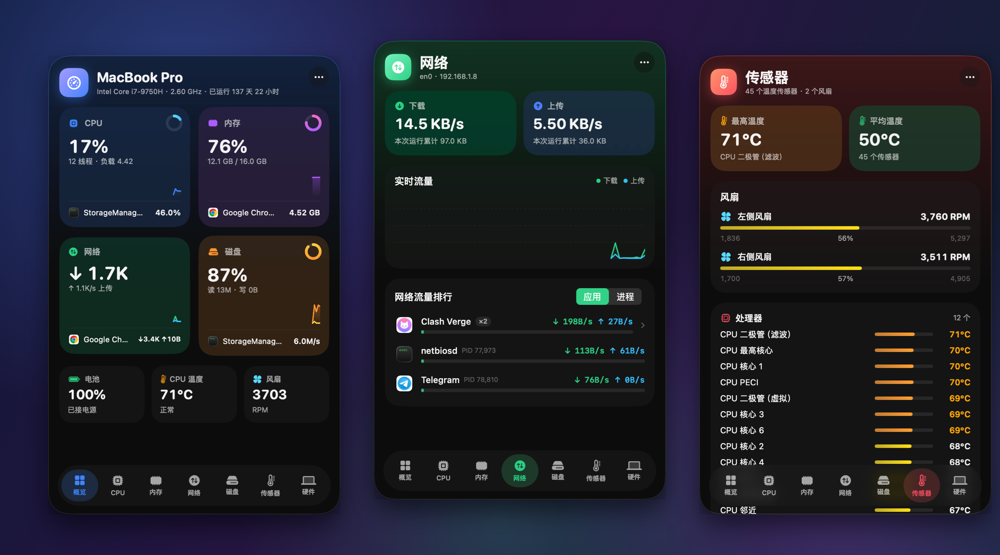

# MonitorX

**谁在吃你的 Mac？一眼就知道。**

macOS 26 菜单栏系统监视器 · Liquid Glass 界面 · CPU / 内存 / 网络 / 磁盘 / 传感器 / 硬件

</div>

---

## 亮点

- **直接告诉你是谁**：概览页每张卡片底部写出该资源当前占用最高的应用；明细页按应用合并（Chrome 的几十个 Helper 合成一行），点开看每个进程。
- **六大分类**：概览、CPU、内存、网络、磁盘、传感器、硬件，每类一个独立页面。
- **菜单栏常驻**：CPU、内存、网速、磁盘读写可自由勾选，两行紧凑显示，深浅色都清晰。
- **热度着色**：条形图平时是主题色，负载变重依次变黄、橙、红。
- **很轻**：面板关闭时约 1% 单核、约 27 MB 内存；进程级采样仅在面板打开时进行。
- **纯本地**：不发起任何网络请求。
- **23 种语言**：English、简体中文、繁體中文、日本語、한국어、Español、Français、Deutsch、Italiano、Português、Русский、Українська、Polski、Nederlands、Svenska、Türkçe、العربية、עברית、हिन्दी、ไทย、Tiếng Việt、Bahasa Indonesia、Bahasa Melayu；默认跟随系统，也可在面板 `···` → 语言 中随时切换，阿拉伯语 / 希伯来语自动从右到左布局。

<div align="center">
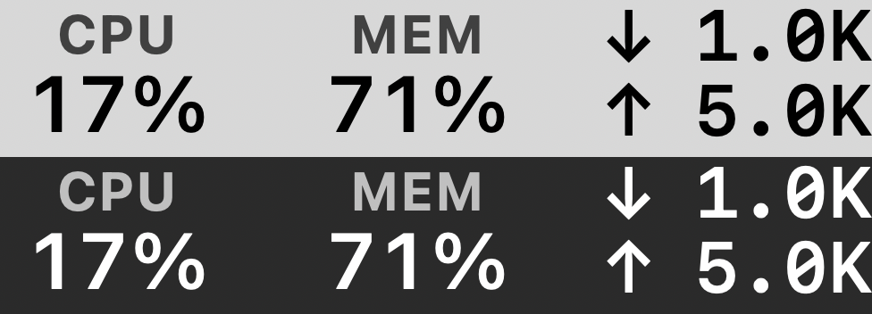
<br><sub>菜单栏：CPU · 内存 · 网速（浅色 / 深色背景）</sub>
</div>

## 截图

<table>
  <tr>
    <td align="center">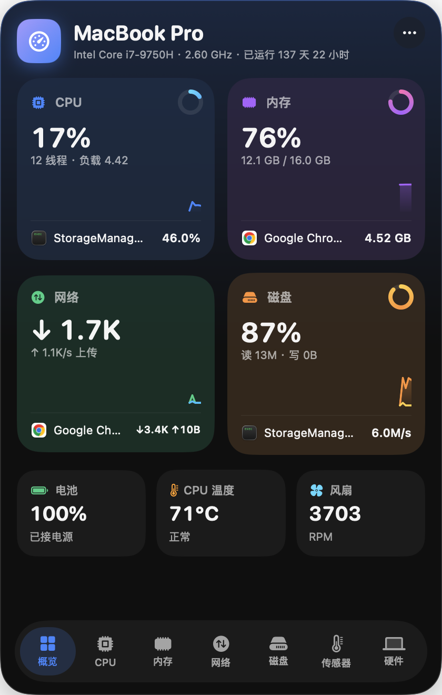<br><b>概览</b><br><sub>四张资源卡 + 电池 / 温度 / 风扇</sub></td>
    <td align="center">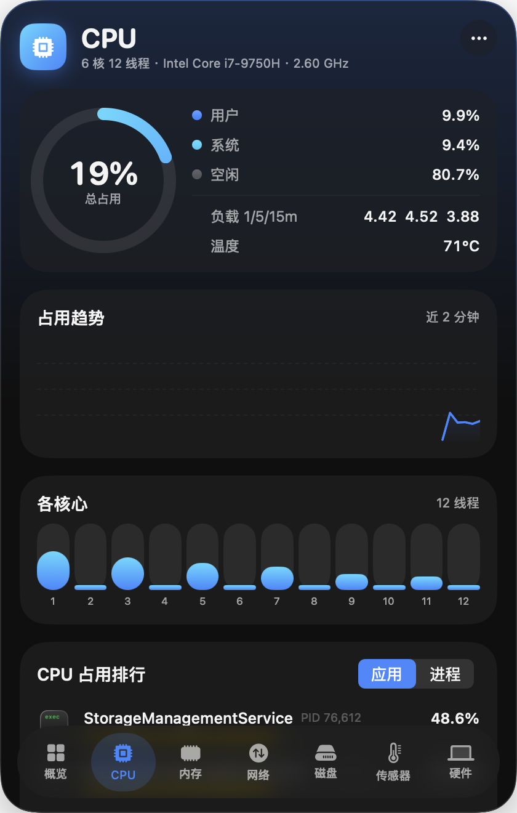<br><b>CPU</b><br><sub>用户/系统/空闲、负载、各核心</sub></td>
    <td align="center">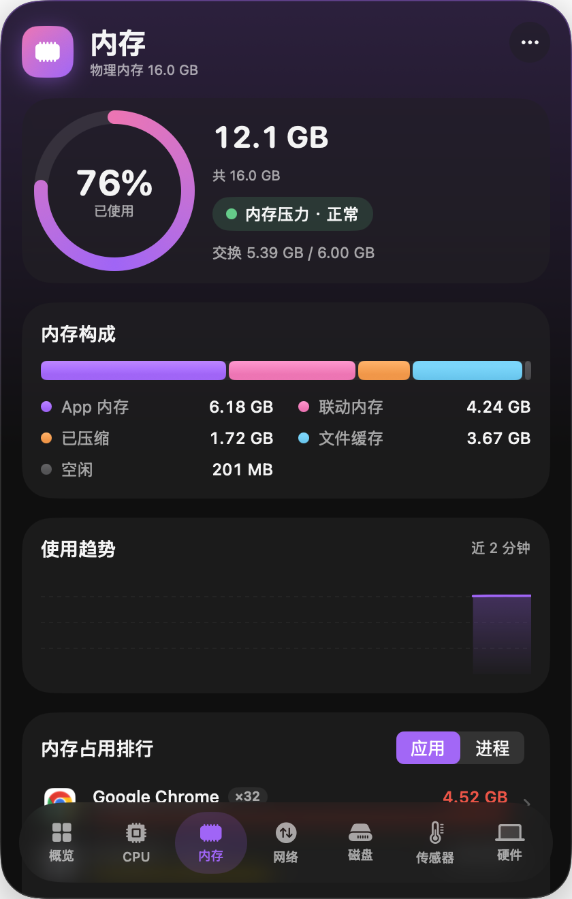<br><b>内存</b><br><sub>构成、压力、交换空间</sub></td>
  </tr>
  <tr>
    <td align="center">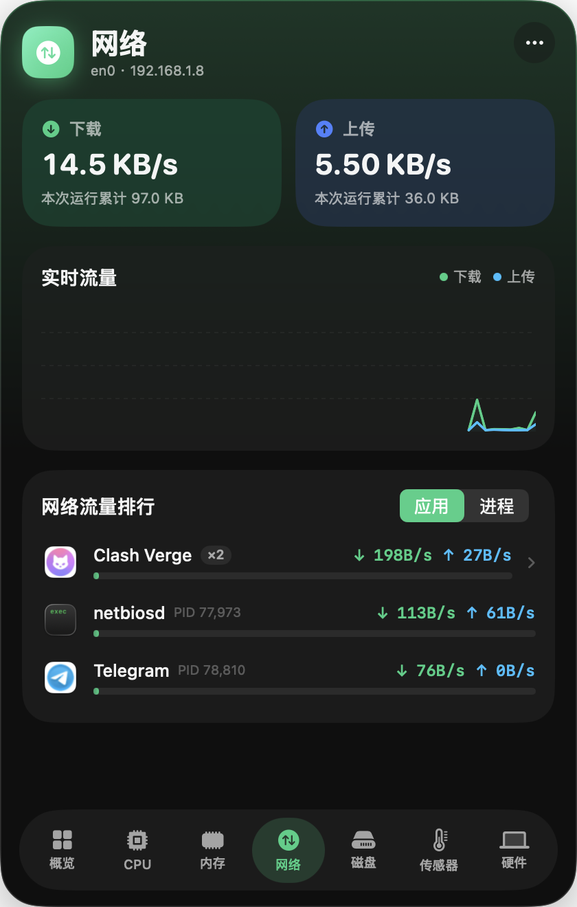<br><b>网络</b><br><sub>上下行速度与每应用流量排行</sub></td>
    <td align="center">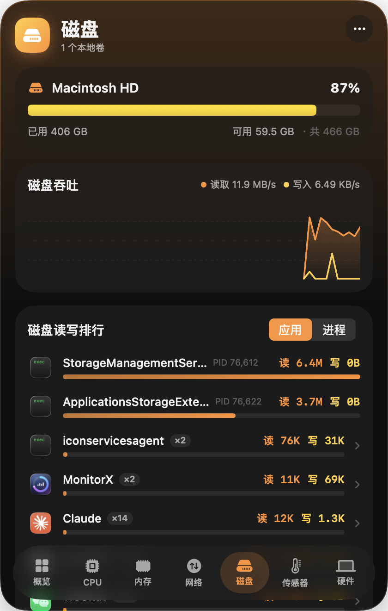<br><b>磁盘</b><br><sub>各卷容量、读写吞吐</sub></td>
    <td align="center">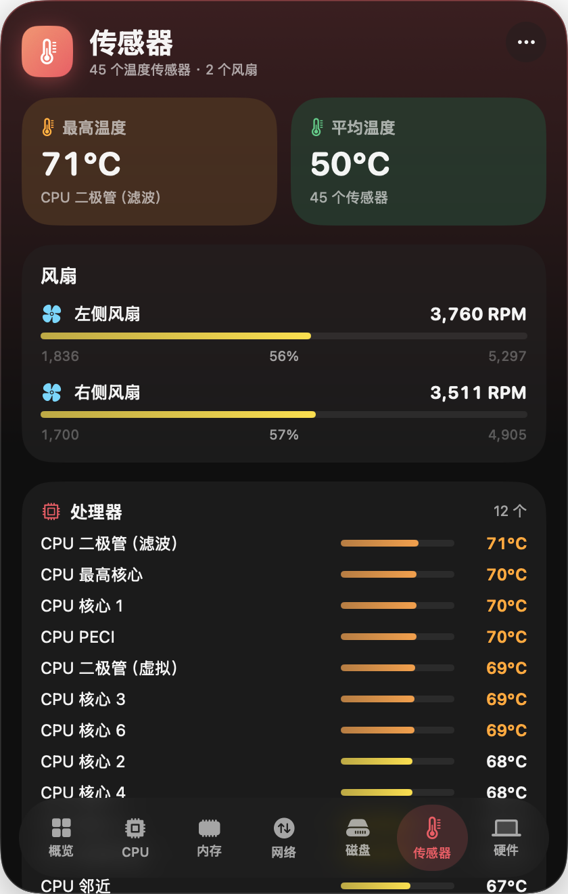<br><b>传感器</b><br><sub>全部温度传感器 + 风扇</sub></td>
  </tr>
  <tr>
    <td align="center">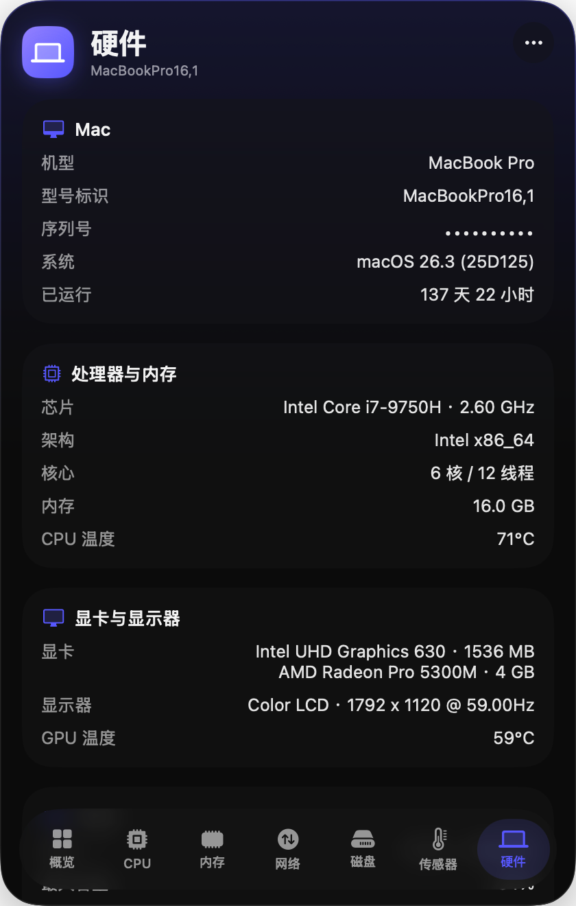<br><b>硬件</b><br><sub>机型、芯片、GPU、电池健康度</sub></td>
    <td align="center">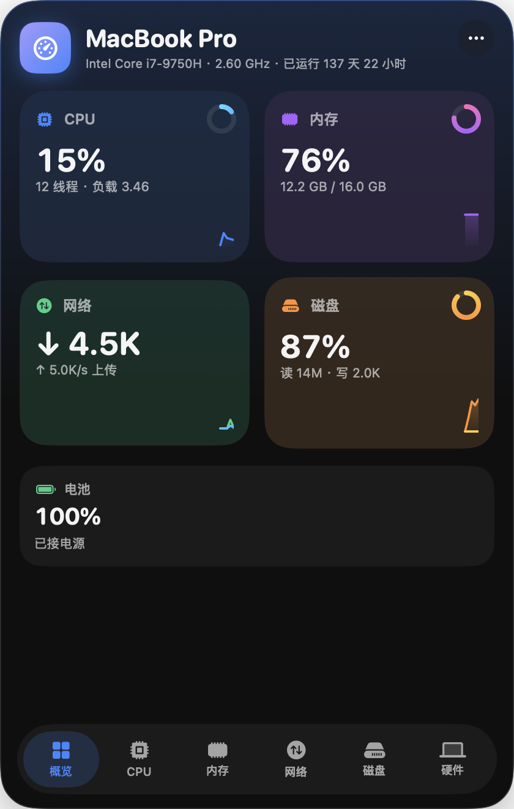<br><b>App Store 版 · 概览</b><br><sub>沙盒精简版，无进程排行</sub></td>
    <td align="center">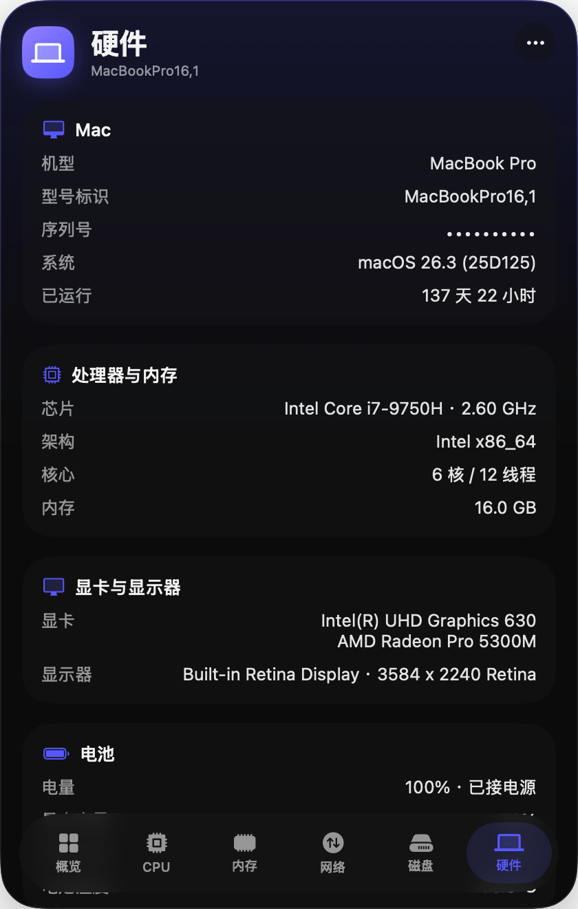<br><b>App Store 版 · 硬件</b><br><sub>序列号 / GPU 改用沙盒安全接口</sub></td>
  </tr>
</table>

> 截图来自真实运行的 App（Intel MacBook Pro，macOS 26.3）。面板背景是 Liquid Glass，会随桌面壁纸透出，截图里看到的是深色底。

## 安装

**下载安装包**（`dist/` 里的 `.dmg`，或 [落地页](website/README.md) 上的下载按钮）：

1. 打开 dmg，把 MonitorX 拖进「应用程序」。
2. 首次运行若提示无法验证开发者（未公证的包），执行一次：
   ```bash
   xattr -cr /Applications/MonitorX.app
   ```
   或右键 → 打开。
3. 菜单栏出现数字，点击展开面板；右键可退出。

**从源码构建**（只需要 Command Line Tools，不需要 Xcode，要求 macOS 26 SDK）：

```bash
Scripts/build.sh          # 生成 build/MonitorX.app（x86_64 + arm64 通用，ad-hoc 签名）
open build/MonitorX.app
```

`open build/MonitorX.app --args --show` 启动后直接展开面板。

## 使用

- **左键**点击菜单栏数字：展开面板；`Esc` 或点击别处关闭。
- **右键**点击：打开 / 退出菜单。
- 面板右上角 `···`：选择菜单栏显示哪些指标、开机启动、退出。
- 概览页点击任意卡片进入对应明细页。
- 明细页底部的占用排行：默认按应用合并，点击行展开各进程；右上角可切换「应用 / 进程」。
- 硬件页的序列号点击即可复制。

## 多语言

- 翻译文件在 `Resources/Localization/<语言>.lproj/Localizable.strings`，`Scripts/build.sh` 会把它们拷进 `.app` 并写入 `CFBundleLocalizations`（因此 macOS「系统设置 → 通用 → 语言与地区 → App」里也能单独给 MonitorX 指定语言）。
- 代码里用 `L("English text")` / `L("Format %@", arg)` 取文案，键就是英文原文；缺翻译时回退为英文。
- 新增或修改文案后运行 `Scripts/check_localizations.py`，检查每种语言是否缺键、多余键、占位符（`%@` / `%1$@`）是否一致。
- 新增语言：复制 `en.lproj` 改名并翻译，再在 `Sources/MonitorX/App/Localization.swift` 的 `AppLanguage` 里加一项。

## 两个版本

| | 官网版（direct） | App Store 版（appstore） |
| --- | --- | --- |
| 构建 | `Scripts/build.sh` → `build/MonitorX.app` | `EDITION=appstore Scripts/build.sh` → `build/appstore/MonitorX.app` |
| 出包 | `Scripts/release.sh`（签名 + 公证 + dmg） | `Scripts/release_appstore.sh`（签名 + pkg，上传 App Store Connect） |
| 沙盒 | 无 | **有**（`Resources/AppStore.entitlements`） |
| CPU / 内存 / 网络 / 磁盘 / 电池 / 硬件信息 | ✅ | ✅ |
| 进程占用排行与明细 | ✅ | ❌ 沙盒禁止读取其他进程 |
| 传感器页（全部温度 + 风扇） | ✅ | ❌ 沙盒禁止访问 AppleSMC |

App Store 版用 `-DAPPSTORE` 编译，被裁掉的功能（`ps` / `netstat` / `system_profiler` / SMC）的代码不会进入二进制。
序列号、GPU、显示器信息改用 IOKit 注册表 / Metal / AppKit 读取。
`Scripts/build.sh` 构建的 App Store 版带沙盒签名（ad-hoc），可以在本机直接运行，看到的就是上架后的真实能力。

## 出包

```bash
# 官网版：签名 + 公证 + dmg（没有证书时生成 ad-hoc 包，仅供自用/朋友）
VERSION=1.1.0 \
SIGN_IDENTITY="Developer ID Application: 你的名字 (TEAMID)" \
NOTARY_PROFILE=notary \
Scripts/release.sh

# App Store 版：签名 + pkg（没有证书时只生成本地沙盒测试版）
BUNDLE_ID=com.yourname.monitorx TEAM_ID=ABCDE12345 VERSION=1.1.0 BUILD_NUMBER=1 \
APP_IDENTITY="Apple Distribution: 你的名字 (TEAMID)" \
INSTALLER_IDENTITY="3rd Party Mac Developer Installer: 你的名字 (TEAMID)" \
PROVISION_PROFILE=~/Downloads/MonitorX.provisionprofile \
Scripts/release_appstore.sh
```

两个脚本的头部注释里有一次性准备步骤（证书、公证凭据、描述文件）。产物在 `dist/`。

## 落地页（Docker 部署）

[`website/`](website/) 是一个纯静态落地页（无构建步骤），用 nginx 提供服务：

```bash
cd website
docker compose up -d --build      # http://localhost:8080，PORT=3000 可改端口
```

下载按钮指向 `website/downloads/MonitorX.dmg`；发新版本时替换该文件即可（compose 已将目录挂载进容器，无需重建镜像）。
详见 [website/README.md](website/README.md)。

## 数据来源

| 指标 | 来源 |
| --- | --- |
| CPU 总量 / 各核 | `host_processor_info` |
| 内存构成 / 压力 / 交换 | `host_statistics64`、`sysctl` |
| 网络速率 | `getifaddrs`（仅 `en*` 接口） |
| 磁盘容量 / 吞吐 | `URLResourceValues`、IOKit `IOBlockStorageDriver` |
| 进程 CPU / 内存 / 磁盘 | `proc_pid_rusage`（内存为 Activity Monitor 同口径的 footprint） |
| root 进程（WindowServer 等） | `ps`（内存为 RSS） |
| 进程网络 | `netstat -anv`（按 socket 累计字节差分，忽略回环流量） |
| 温度 / 风扇（传感器页枚举全部 `T*` 键） | AppleSMC（仅官网版） |
| 电池 | IOKit `AppleSmartBattery` |
| 序列号 / GPU / 显示器 | 官网版 `system_profiler`；App Store 版 IOKit 注册表 / Metal / AppKit |

面板关闭时只采样系统级指标；进程级采样仅在面板打开时进行（3 秒一次）。

## 已知限制

- 需要 macOS 26（使用了 `NSGlassEffectView` 与 `glassEffect`）。
- 默认发布包是 ad-hoc 签名，未公证；正式分发请用 `Scripts/release.sh` 配合 Developer ID。
- root 进程的内存为 RSS，与活动监视器的 footprint 口径略有差别。
- 进程网络流量忽略回环，所以经本机代理转发的流量只会算在代理软件上。
- Apple Silicon 上的温度传感器键名与 Intel 不同，部分机型可能读不到全部传感器（仅在 Intel MacBook Pro 上实测）。

## 目录结构

```
Sources/MonitorX/
  App/        AppDelegate、菜单栏图标、玻璃面板、设置、版本开关（Edition）、多语言（Localization）
  Sampling/   CPU / 内存 / 网络 / 磁盘 / 进程 / 传感器 / 硬件采样，SystemMonitor 汇总
  UI/         SwiftUI 页面与组件
Scripts/      build.sh、release.sh、release_appstore.sh、make_icon.swift、check_localizations.py
Resources/    AppStore.entitlements、Localization/（23 种语言的 Localizable.strings）
website/      落地页 + Dockerfile + nginx 配置
docs/images/  README 截图
```
